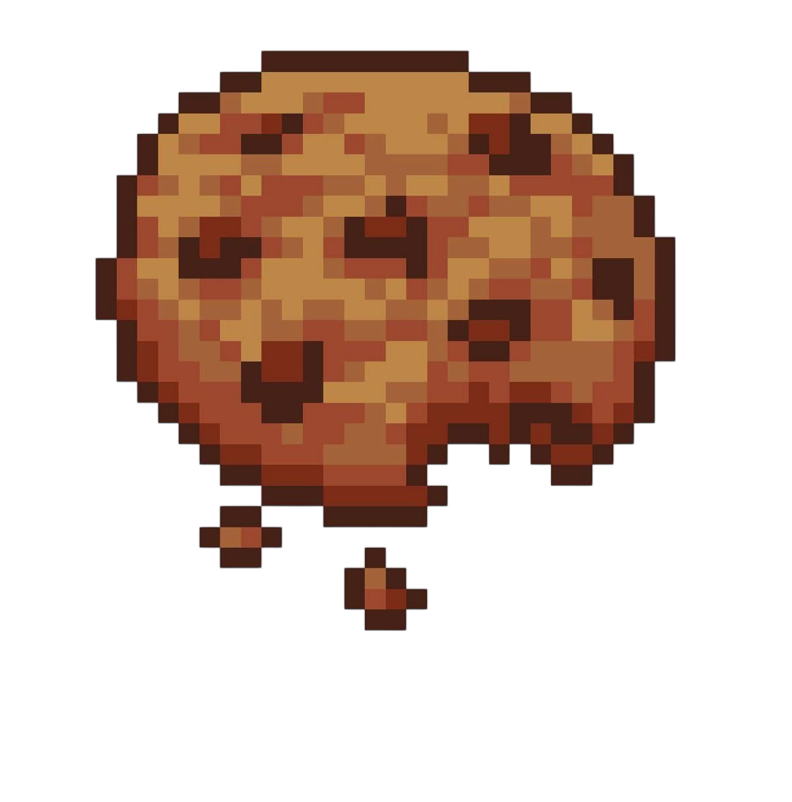
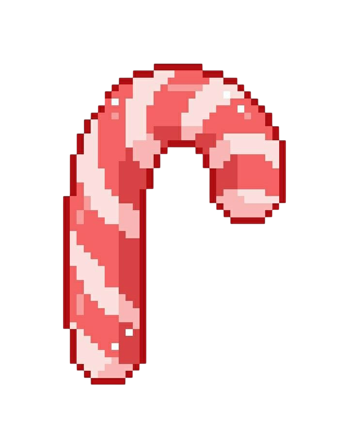

﹒˚ ₊ ︵﹒⊹ ๑ ︵︵ ๑ ⊹﹒︵﹒˚ ₊ ︵﹒⊹ ๑ ︵︵ ๑ ⊹﹒︵﹒˚ ₊ ︵﹒⊹ ๑ ︵︵ ๑ ⊹﹒︵﹒˚ ₊ ︵﹒⊹ ๑ ︵︵ ๑ ⊹﹒︵﹒˚ ₊

🇧🇷
# Doceria - CRUD em React

Aplicação de CRUD (Cadastrar, Listar, Editar e Excluir) desenvolvida como atividade avaliativa da disciplina de Técnicas Avançadas de Programação Web e Mobile, do curso de Análise e Desenvolvimento de Sistemas.


##  Sobre o projeto

O sistema simula o gerenciamento de doces de uma doceria, permitindo cadastrar novos doces, visualizar os já cadastrados, editar suas informações e excluí-los, tudo manipulado apenas em memória durante a execução da aplicação, sem uso de banco de dados ou API externa.

##  Funcionalidades

- ✅ Listagem dos doces cadastrados
- ✅ Cadastro de novos doces
- ✅ Edição de doces existentes
- ✅ Exclusão de doces
- ✅ Busca por nome (funcionalidade bônus)

##  Tecnologias utilizadas

- [React](https://react.dev/)
- [Vite](https://vite.dev/)
- JavaScript (ES6+)
- CSS e HTML

##  Estrutura do projeto

```bash
src/
├── assets/ # ícones e imagens decorativas
├── components/
│ ├── FormDoce.jsx # formulário de cadastro/edição
│ └── ListaDoces.jsx # listagem e busca dos doces
├── data/
│ └── doces.json # dados iniciais
├── App.jsx
├── App.css
└── main.jsx
```

##  Como executar o projeto

Pré-requisito: ter o [Node.js](https://nodejs.org/) instalado.

```bash
# Clone o repositório
git clone https://github.com/Helo0isa/crud-doceria-react.git

# Entre na pasta do projeto
cd crud-doceria-react

# Instale as dependências
npm install

# Rode o projeto
npm run dev
```

Depois disso, acesse o endereço mostrado no terminal.

##  Integrantes

- Heloisa Avelino Mazon
- Filipe Henrique Ricci
- Guilherme Avelino Betelli
- Miguel Di-Tanno Viganó

##

**Curso:** Análise e Desenvolvimento de Sistemas

**Disciplina:** Técnicas Avançadas de Programação Web e Mobile

**Professor:** Ederaldo Ratz

﹒˚ ₊ ︵﹒⊹ ๑ ︵︵ ๑ ⊹﹒︵﹒˚ ₊ ︵﹒⊹ ๑ ︵︵ ๑ ⊹﹒︵﹒˚ ₊ ︵﹒⊹ ๑ ︵︵ ๑ ⊹﹒︵﹒˚ ₊ ︵﹒⊹ ๑ ︵︵ ๑ ⊹﹒︵﹒˚ ₊

﹒˚ ₊ ︵﹒⊹ ๑ ︵︵ ๑ ⊹﹒︵﹒˚ ₊ ︵﹒⊹ ๑ ︵︵ ๑ ⊹﹒︵﹒˚ ₊ ︵﹒⊹ ๑ ︵︵ ๑ ⊹﹒︵﹒˚ ₊ ︵﹒⊹ ๑ ︵︵ ๑ ⊹﹒︵﹒˚ ₊ 

🇺🇸
# Candy Shop - CRUD in React

CRUD application (Create, Read, Update and Delete) developed as an evaluative assignment for the Advanced Web and Mobile Programming Techniques course, part of the Systems Analysis and Development program.

##  About the project

The system simulates the management of a candy shop, allowing new sweets to be registered, existing ones to be viewed, their information edited, and them to be deleted, all handled in memory during the application's runtime, with no database or external API involved.

##  Features

- ✅ List registered sweets
- ✅ Register new sweets
- ✅ Edit existing sweets
- ✅ Delete sweets
- ✅ Search by name (bonus feature)

##  Technologies used

- [React](https://react.dev/)
- [Vite](https://vite.dev/)
- JavaScript (ES6+)
- CSS and HTML

##  Project structure

```bash
src/
├── assets/ # decorative icons and images
├── components/
│ ├── FormDoce.jsx # registration/edit form
│ └── ListaDoces.jsx # sweets listing and search
├── data/
│ └── doces.json # initial data
├── App.jsx
├── App.css
└── main.jsx
```

##  How to run the project

Prerequisite: have [Node.js](https://nodejs.org/) installed.

```bash
# Clone the repository
git clone https://github.com/Helo0isa/crud-doceria-react.git

# Enter the project folder
cd crud-doceria-react

# Install dependencies
npm install

# Run the project
npm run dev
```

After that, access the address shown in the terminal.

##  Team members

- Heloisa Avelino Mazon
- Filipe Henrique Ricci
- Guilherme Avelino Betelli
- Miguel Di-Tanno Viganó

##

**Course:** Systems Analysis and Development

**Subject:** Advanced Web and Mobile Programming Techniques

**Professor:** Ederaldo Ratz

﹒˚ ₊ ︵﹒⊹ ๑ ︵︵ ๑ ⊹﹒︵﹒˚ ₊ ︵﹒⊹ ๑ ︵︵ ๑ ⊹﹒︵﹒˚ ₊ ︵﹒⊹ ๑ ︵︵ ๑ ⊹﹒︵﹒˚ ₊ ︵﹒⊹ ๑ ︵︵ ๑ ⊹﹒︵﹒˚ ₊
